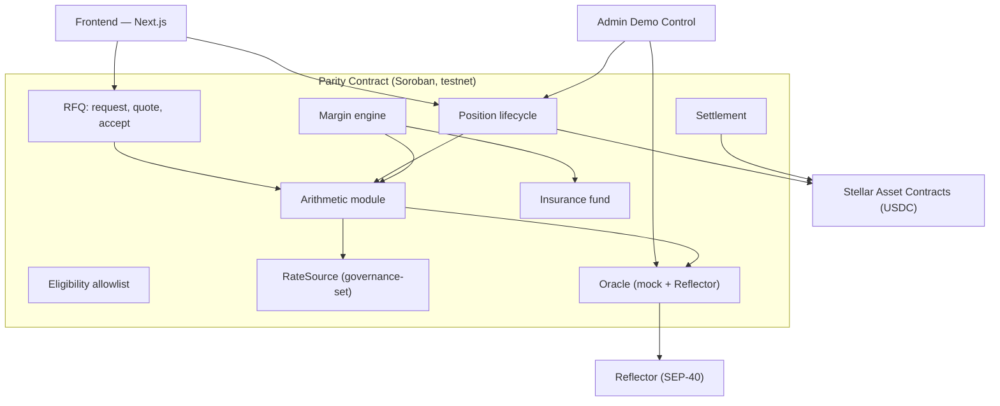

# Parity — Stellar FX Forward Market

**Live Demo**: [parity-stellar.vercel.app](https://parity-stellar.vercel.app)

A two-sided, margined FX forward market between Stellar fiat stablecoins, where the forward price is computed on-chain from covered interest parity instead of being quoted by a dealer.

## What It Does

Parity lets two parties lock a future exchange rate between Stellar stablecoins (e.g., USDC ↔ MXNe, USDC ↔ TRY). The forward price comes from the no-arbitrage covered interest parity formula:

```
F = S × (1 + r_quote × t/360) / (1 + r_base × t/360)
```

- Both sides post collateral (5% initial margin in USDC)
- Positions are marked to market on each oracle update
- Margin calls fire at 50% loss; liquidation at 100%
- Bad debt follows a fixed waterfall: loser's margin → insurance fund → haircut on winner's payout
- Cash settlement at maturity pays the difference in USDC

## The Problem

Stellar carries ~20 fiat stablecoins and tokenized government debt, but nothing hedges the currency exposure between them. A Mexican exporter holding MXNe and expecting USDC in 90 days has no on-chain instrument for that risk today.

**Existing solutions**: Crebit sells rate locks as a single dealer. **Parity builds the market underneath**: two-sided, symmetric margin, mark-to-market, price discovered on-chain.

## Architecture



### Components

| Component | What It Does |
|---|---|
| **Arithmetic Module** | Forward computation (CIP formula), position valuation, 7-decimal fixed-point, multiply-before-divide |
| **Oracle** | Spot price via Reflector (SEP-40) trait with mock for demo |
| **RateSource** | Interest rates — governance-set implementation (CETES yield for MXN, USDC supply rate for USD) |
| **RFQ** | Post request, submit quote (spread over forward), cancel, accept & open position |
| **Position Lifecycle** | Open with margin, store terms, mark-to-market |
| **Margin Engine** | Margin call at 50% loss, 30% partial liquidation on first breach, full close on continuation |
| **Insurance Fund** | Fed by 2bps open fee + liquidation penalties; second in the loss waterfall |
| **Settlement** | Cash settlement at maturity with bad-debt waterfall |
| **Eligibility** | Allowlist interface for counterparty access |
| **Admin Control** | Demo time/price override — a 90-day contract doesn't fit 4 minutes |

## Running Example

| Parameter | Value |
|---|---|
| Pair | MXN/USD |
| Spot | 20.00 MXN/USD |
| MXN rate / USD rate | 10% / 4% |
| Tenor | 90 days |
| Computed Forward | **20.297** |
| Initial margin | 5,000 USDC per side (5% of 100,000 notional) |

## Demo Flow (5 Steps)

1. **Post & Quote**: Forward computes live to 20.297. A maker quotes, hedger accepts, both post 5,000 USDC.
2. **Day 30, spot 19.61**: Counterparty margin call fires on screen.
3. **Spot 19.15**: Partial liquidation (30%) executes, insurance fund untouched.
4. **Gap to 18.50**: Bad debt appears — waterfall drains insurance, haircuts the winner's payout, accounting balances.
5. **Day 90**: Reset and settle.

## Tech Stack

| Layer | Choice | Why |
|---|---|---|
| Chain | Stellar (Soroban, testnet) | 20+ fiat stablecoins, fee bumps, sponsored reserves, SACs |
| Contracts | Rust, `soroban-sdk` 28.0.0 (pinned) | SDK stability for hackathon |
| Numerics | Fixed-point, 7 decimals, wider intermediates | Matches Stellar native precision |
| Frontend | Next.js 14 + TypeScript + Tailwind | Fast build, Stellar SDK support |
| Wallet | Stellar Wallets Kit / Freighter | Eligible integration partner |
| Oracle | Reflector (SEP-40) behind trait + mock | Demo flexibility |
| Rate Source | Governance-set (CETES yield, USDC supply rate) | Ship even if live rate unreadable |
| Assets | USDC (SEP-41) for margin and settlement | Real issuer, real holders |

## Stellar Integration

| Feature | Usage in Parity |
|---|---|
| Stellar Asset Contracts (SEP-41) | Margin deposits, settlement transfers |
| Reflector Oracle (SEP-40) | Spot price feed behind trait |
| Soroban Auth | Each party authorizes their own margin transfer |
| Testnet deployment | All contracts live on testnet |

## Key Design Decisions

1. **Price from CIP, not a dealer** — The no-arbitrage argument makes the number objective
2. **RFQ over LP pool** — No pooled capital needed; removes riskiest module
3. **Two-sided symmetric margin** — Both sides equally collateralized
4. **Explicit loss allocation** — Gap risk can't be zero; waterfall makes allocation automatic
5. **Arithmetic module first** — Property tests ensure no silent precision errors
6. **30% partial liquidation** — Avoids closing entire position on one breach
7. **3-print liquidation price** — Single bad oracle print can't cascade

## Tests

```bash
# Run all tests (14 passing)
cargo test --package parity

# Property tests cover:
# - Zero value at inception
# - Two sides sum to zero at every price
# - No overflow on extreme inputs
# - Forward computation matches spec (20.297)
# - Margin call at day 30, spot 19.61
# - Liquidation at day 30, spot 19.15
# - Cancelled/expired quotes cannot be accepted
# - Insurance fund fed by open fee
# - Full lifecycle: post → quote → accept → mark → settle
```

## Setup & Deployment

```bash
# Prerequisites
rustup target add wasm32v1-none
cargo install stellar-cli

# Build
stellar contract build

# Test
cargo test --package parity

# Deploy to testnet
./scripts/deploy.sh

# Frontend
cd frontend
npm install
cp .env.example .env.local  # Set CONTRACT_ID from deploy output
npm run dev
```

## Contract ID & Artifacts

- **Network**: Stellar Testnet
- **Contract ID**: `CAW7STGSNYT7BYTXQ4QI7OMUCTICUFT4CZQ23CVTTXYNZJXSXOZTOTNI`
- **Admin**: `GDGOOYD5ZSQW7QKQZ4SBGKDS6YI44EDQMCOSZUA3GH56ZATUYCVPMDQI`
- **WASM Hash**: `0a293c1f7a83ff1e963037a7b6c09a32d203f0b64f8fe1c9e18bc134fa0d97ad`
- **Explorer**: [View on Stellar Expert](https://lab.stellar.org/r/testnet/contract/CAW7STGSNYT7BYTXQ4QI7OMUCTICUFT4CZQ23CVTTXYNZJXSXOZTOTNI)
- **Live Demo**: [parity-stellar.vercel.app](https://parity-stellar.vercel.app)
- **GitHub**: [github.com/nurkardelens/parity-stellar](https://github.com/nurkardelens/parity-stellar)
- **Exported Functions**: 21 (initialize, post_request, submit_quote, accept_quote, mark_position, liquidate, settle, etc.)

## Corridors

| Pair | Base Rate Source | Quote Rate Source | Status |
|---|---|---|---|
| MXN/USD | USD: 4% (USDC supply rate) | MXN: 10% (CETES yield via Etherfuse) | Demo ready |
| TRY/USD | USD: 4% | TRY: 45% (TCMB policy rate) | Demo ready |

## Trade-offs & Risks

| Risk | Mitigation |
|---|---|
| Gap risk (price jumps past liquidation) | Waterfall; maintenance margin; partial liquidation; 3-print price |
| No quote = no trade (RFQ dependency) | On testnet, team plays maker; pool-as-maker is later addition |
| Winner's haircut | Insurance fund; explicit allocation visible before committing |
| Silent arithmetic errors | Arithmetic module first with property tests; one scaling convention |

## Stellar Skills Used

- `skills/standards/SKILL.md` — SEP-40 (Reflector oracle), SEP-41 (Stellar Asset Contracts)
- `skills/anchors/SKILL.md` — Anchor integration patterns for TRY corridor
- `skills/stellar-integration-finder/SKILL.md` — Protocol selection and integration routing

## Post-Hackathon Roadmap

1. **Week 1-2**: Reflector live integration (replace mock oracle), Blend v2 for live USDC rate
2. **Week 3-4**: Physical settlement via atomic swap, standalone keeper bot
3. **Month 2**: Re-auction of liquidated positions, second corridor (BRZ/USD)
4. **Month 3**: SCF/InstAward application, security audit, mainnet deployment

## Team

- **Nur Kardelen**
- **Atakan Yavuzarslan**

## License

MIT
